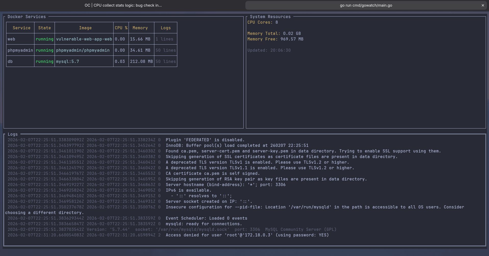

# GoWatch

GoWatch is a lightweight, real-time monitoring tool **written in Go** for Docker containers. It provides developers with instant visibility into container resource usage, logs, and system metrics directly in the terminal. Perfect for local development environments, GoWatch works with **any service running in Docker** regardless of the programming language, with planned AWS Serverless support for monitoring CloudWatch, XRay, Lambda, and CloudFormation resources.

## Features

- **Universal Container Monitoring**: Monitor CPU, memory, and resource usage for **any service in Docker** (Node.js, Python, Java, Go, PHP, etc.)
- **Real-time Log Aggregation**: Stream and view container logs from all services in one place
- **Live Resource Tracking**: Track CPU percentage, memory usage, and system metrics with automatic updates
- **Docker Integration**: Direct Docker daemon integration using the Moby client library
- **Terminal UI Dashboard**: Beautiful, interactive terminal interface built with tcell and tview
- **Zero Configuration**: Auto-detects running containers and requires no setup
- **Development Focused**: Perfect for docker-compose environments and local microservice development
- **Lightweight**: Minimal resource footprint, built in pure Go
- **Future AWS Integration**: Planned support for AWS services like CloudWatch, XRay, Lambda, and CloudFormation

## Development Environment

GoWatch includes a fully configured Docker development environment:

### Docker Development Container

The project includes a complete Docker setup for development:

- **Dockerfile**: Multi-stage build using Go tip-alpine and Alpine runtime
- **Docker Compose**: Pre-configured service with volume mounts and Docker socket access
- **Development Tools**: Includes security scanning and field alignment tools

### Quick Start with Docker

```bash
# Build the Docker development environment
make docker-build

# Run GoWatch in Docker to monitor your services
docker compose up
```

## User Interface

GoWatch provides a real-time terminal dashboard with three main sections:

**Docker Services Table** - View all running containers with:
- Container status (Running, Stopped, etc.)
- Container image information
- CPU usage percentage
- Memory consumption (MB)
- Log line count

**System Resources Panel** - Monitor host system:
- Total CPU cores
- Total memory
- Available free memory
- Last update timestamp

**Logs Section** - Aggregate logs from all containers:
- Color-coded output
- Real-time log streaming
- Service name identification

### Dashboard Example



The interactive dashboard updates every 2 seconds, providing live visibility into your containerized services.

### Manual Installation

To install GoWatch locally, ensure you have Go 1.25.3 or later installed:

```bash
git clone https://github.com/b92c/gowatch.git
cd gowatch
make install
make run
```

## Build Commands

```bash
# Install dependencies and hooks
make install

# Build the binary
make build

# Run the application
make run

# Build Docker image
make docker-build

# Run tests
make test

# Security scan
make go-sec

# Fix struct field alignment
make field-fix
```

## Project Structure

```
gowatch/
├── cmd/gowatch/          # Application entry point
├── internal/
│   ├── aws/              # Future AWS integrations (XRay, CloudWatch, Lambda, CloudFormation)
│   ├── docker/           # Docker monitoring and collection
│   ├── trace/            # Distributed tracing functionality
│   ├── ui/               # Terminal UI components and dashboard
│   └── config/           # Configuration management
├── pkg/metrics/          # Metrics types and definitions
├── docker-compose.yaml   # Docker development environment
├── Dockerfile           # Multi-stage build configuration
└── makefile            # Build and development commands
```

## Configuration

GoWatch is designed to work out-of-the-box with Docker environments. The tool automatically:

- **Detects all running Docker containers** on the host system
- **Accesses the Docker daemon socket** for real-time container metrics
- **Streams logs** from all monitored containers
- **Calculates resource usage** based on Docker cgroup statistics

No configuration files or environment variables needed - just run `gowatch` and start monitoring!

## Use Cases

GoWatch is ideal for:

- **Local Microservices Development**: Monitor multiple services in docker-compose environments
- **Performance Debugging**: Quickly identify which containers are consuming excessive CPU or memory
- **Log Troubleshooting**: Aggregate logs from all services to debug issues across your stack
- **Development Environment Monitoring**: Keep an eye on resource usage while coding and testing
- **Container Health Checks**: Ensure all your services are running and healthy

## Supported Technologies

Since GoWatch monitors any Docker container, you can use it with services written in:

- **Go** (Go applications)
- **Python** (Django, FastAPI, Flask, etc.)
- **Node.js** (Express, NestJS, etc.)
- **Java** (Spring Boot, Quarkus, etc.)
- **PHP** (Laravel, Symfony, etc.)
- **Ruby** (Rails, Sinatra, etc.)
- **C#** (.NET, ASP.NET Core)
- **Rust** (Actix, Rocket, etc.)
- Any other language/framework running in Docker containers

## Contributing

1. Fork the repository
2. Create a feature branch
3. Make your changes
4. Run tests and security checks
5. Submit a pull request

## License

MIT
